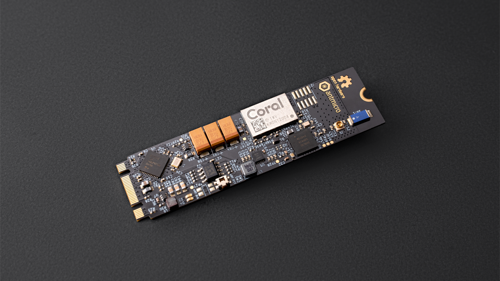

# M.2 Smart IoT Module

Copyright (c) 2020-2026 [Antmicro](https://www.antmicro.com)

## Overview

This project contains PCB design files of the smart IoT module in an M.2 form factor.
The module is an experimental platform that combines a programmable Nordic radio SoC with Google Coral Edge AI accelerator.
The design files were prepared in KiCad.

## Repository structure

The main repository directory contains KiCad PCB project files, a LICENSE and a README.
The remaining files are stored in the following directories:

* ``lib`` - contains the component libraries
* ``img`` - contains graphics for this README
* ``fab`` - contains overrides for board visualization

## Key Features

* Google Coral Edge TPU Accelerator Module
* Nordic Semiconductor nRF52840 Radio SoC
* On-board PCIe-USB bridge
* On-board FTDI chip for nRF52840 programming, debugging and serial communication
* M.2 key B+M form factor 
* 22 x 80 mm (0.87 x 3.15 inch) PCB outline

## License

[Apache-2.0](LICENSE)
