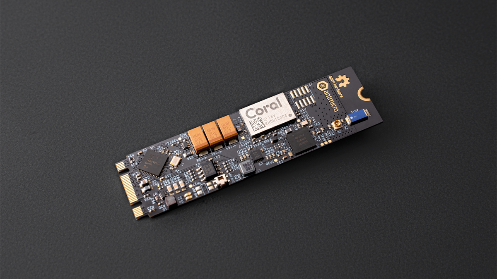
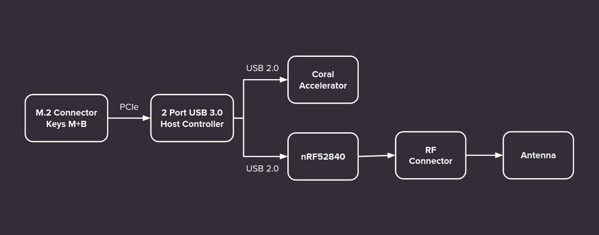

====================
M.2 Smart IoT Module
====================

Copyright (c) 2020-2021 `Antmicro <https://www.antmicro.com>`_

Overview
--------

This repository contains design files of the smart IoT module in an M.2 form factor.
The module is an experimental platform that combines a programmable Nordic radio SoC with Google Coral Edge AI accelerator.
The design files were prepared in KiCad.
An initial production release for the design was fabricated as prototypes and these are now being tested.

Repository structure
--------------------
The main repository directory contains KiCad PCB project files, a LICENSE and README.
The remaining files are stored in the following directories:

* ``lib`` - contains the component libraries
* ``img`` - contains graphics for this README

Key Features
------------

* M.2 key B+M form factor 
* on-board PCIe-USB bridge
* Nordic Semiconductor nRF52840 Radio SoC
* Google Coral Edge TPU Accelerator Module

Block diagram
-------------

License
=======

`Apache-2.0 <LICENSE>`_
